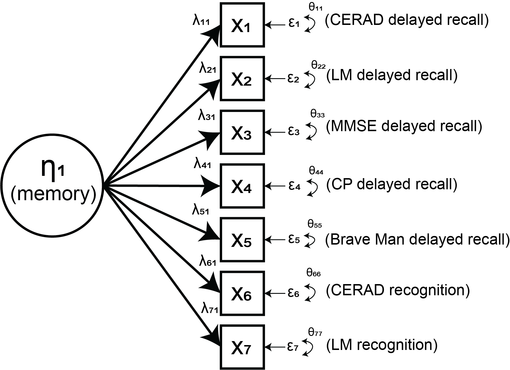
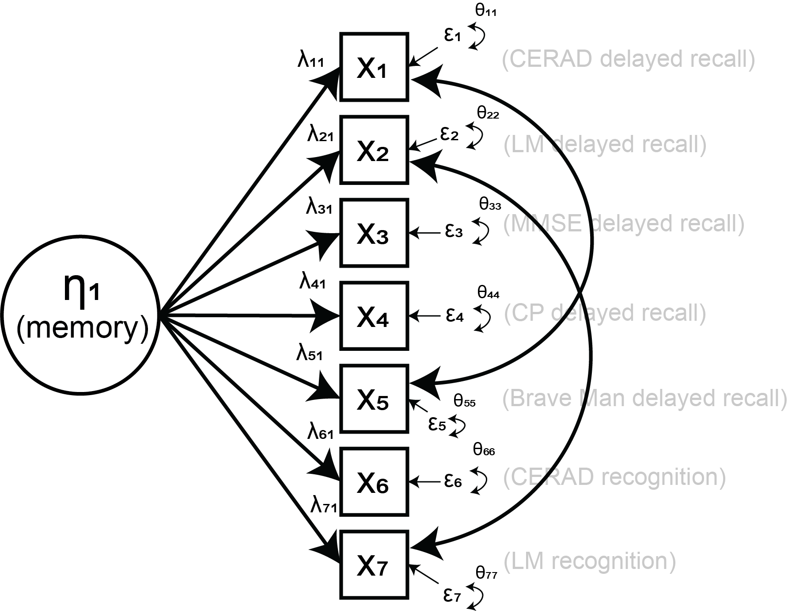
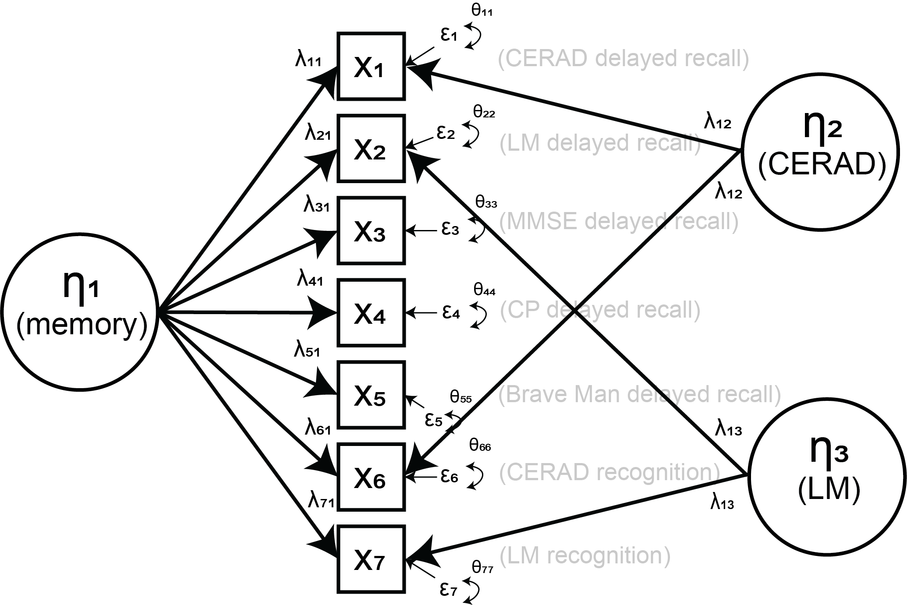

## Goals

::: {.small-text}
Run our first model in Mplus and lavaan!

- Use prepped data. 
- Run models. 
- Compare across Mplus/Mplus automation and lavaan. 
- Inspect output. 
- Adding methods factors. 
:::

## Initial model specification 

{.diagram}


## Workflow reminders
::: columns
::: {.column width="50%"}

:::
::: {.column width="50%"}

:::
:::

```{r setup}
#| message: false
#| warning: false
#| include: false

library(tidyverse)
library(haven)
library(lavaan)
library(MplusAutomation)

if (Sys.info()["sysname"] == "Windows"){
  dropbox_dir <- "C:/Users/emmanich/P2AGING Dropbox/Emma Nichols/"
} else {
  dropbox_dir <- "/Users/emmanich/P2AGING Dropbox/Emma Nichols/"
}

data_file <- paste0(
  dropbox_dir,
  "HCAP-R25-Best-Practices/POSTED/DATA/SOURCE/",
  "hcap2016_memory_analytic.dta"
)
mplus_dir <- paste0(
  dropbox_dir,
  "HCAP-R25-Best-Practices/POSTED/DATA/DERIVED/", 
  "mplus_exports"
)

hcap_raw <- haven::read_dta(data_file)

available_vars <- names(hcap_raw)

memory_raw_vars <- c(
  "vdmde1", "vdmde2", "vdmde3", "vdmde4", "vdmde5",
  "vdmre1", "vdmre2"
)

memory_z_vars <- c(
  "vdmde1z", "vdmde2z", "vdmde4z", "vdmde5z",
  "vdmre1z", "vdmre2z"
)

memory_vars <- sort(c(
  memory_z_vars, 
  setdiff(memory_raw_vars, stringr::str_replace(memory_z_vars, "z$", ""))
))

lavaan_dat <- hcap_raw |>
  mutate(
    id = row_number(),
    across(all_of(c(memory_vars)), as.numeric),
    .keep = "none"
  )

mplus_dat <- lavaan_dat |>
  mutate(
    id = id,
    de1 = vdmde1z,
    de2 = vdmde2z,
    de3 = vdmde3, 
    de4 = vdmde4z,
    de5 = vdmde5z,
    re1 = vdmre1z,
    re2 = vdmre2z,
    .keep = "none"
  )
```

## Review the data stucture of prepped datasets 


### lavaan
```{r data-structure-analysis}
lavaan_dat |>
  slice_head(n = 8)
```

### Mplus
```{r data-structure-mplus}
mplus_dat |>
  slice_head(n = 8)
```


## Model statements

::: columns
::: {.column width="50%"}
### lavaan
```r
model <- '
  mem =~ vdmde1z + vdmde2z + vdmde3 + vdmde4z + 
         vdmde5z + vdmre1z + vdmre2z
'
fit <- cfa(
  model, 
  data = lavaan_dat, 
  ordered = "vdmde3",
  std.lv = TRUE, 
  meanstructure = TRUE,
  estimator = "WLSMV", 
  mimic = "Mplus"
)
```
:::
::: {.column width="50%"}
### Mplus
```text
TITLE: Memory CFA; 

DATA: 
  FILE = data.dat; 

VARIABLE:
  NAMES = id de1 de2 de3 de4 de5 re1 re2;
  USEVARIABLES = de1 de2 de3 de4 de5 re1 re2;
  CATEGORICAL = de3;
  MISSING = ALL (-9999);
  IDVARIABLE = id;

ANALYSIS:
  ESTIMATOR = WLSMV;
  PARAMETERIZATION = THETA;

MODEL:
  mem BY de1* de2 de3 de4 de5 re1 re2;
  mem@1;
  [mem@0];

OUTPUT:
  STDYX;
```
:::
:::

## Mplus vs. Mplus automation 

::: columns
::: {.column width="50%"}
### Mplus
```text
TITLE: Memory CFA; 

DATA: 
  FILE = data.dat; 

VARIABLE:
  NAMES = id de1 de2 de3 de4 de5 re1 re2;
  USEVARIABLES = de1 de2 de3 de4 de5 re1 re2;
  CATEGORICAL = de3;
  MISSING = ALL (-9999);
  IDVARIABLE = id;

ANALYSIS:
  ESTIMATOR = WLSMV;
  PARAMETERIZATION = THETA;

MODEL:
  mem BY de1* de2 de3 de4 de5 re1 re2;
  mem@1;
  [mem@0];

OUTPUT:
  STDYX;
```
:::
::: {.column width="50%"}
### Mplus automation 
```r
model <- mplusObject(

  TITLE = "Memory CFA;",

  usevariables = c("id", "de1", "de2", "de3", "de4", "de5", "re1", "re2"),

  VARIABLE = "
    CATEGORICAL = de3;
    IDVARIABLE = id;
  ",

  ANALYSIS = "
    ESTIMATOR = WLSMV;
    PARAMETERIZATION = THETA;
  ",

  MODEL = "
    mem BY de1* de2 de3 de4 de5 re1 re2;
    mem@1;
    [mem@0];
  ",

  OUTPUT = "
    STDYX;
  ",

  rdata = df
)

result <- mplusModeler(
  model,
  modelout = "memory_cfa.inp",
  run = 1L
)
```
:::
:::

## Run model in lavaan 
```{r lavaan-model}
lavaan_formula <- '
  mem =~ vdmde1z + vdmde2z + vdmde3 + vdmde4z + 
         vdmde5z + vdmre1z + vdmre2z
'
lavaan_model <- cfa(
  lavaan_formula, 
  data = lavaan_dat, 
  ordered = "vdmde3",
  std.lv = TRUE, 
  meanstructure = TRUE,
  estimator = "WLSMV", 
  parameterization = "theta"
)
summary(lavaan_model, standardized = TRUE)
```

::: {.small-text}
Notes: 

- Std.lv = standardized with respect to latent variable only 
- Std.all = standardized with respect to latent variables and observed indicators
- Std.all loadings are interpretable as the correlation between the latent factor and indicator
- Intercepts are the value of the indicator when the latent factor is 0. With Std.all, this is the standardized value of the indicator when the latent factor is 0. 
:::

## Run model in Mplus (automation)

```{r mplus-model}
mplus_formula <- mplusObject(

  TITLE = "Memory CFA;",

  usevariables = c("id", "de1", "de2", "de3", "de4", "de5", "re1", "re2"),

  VARIABLE = "
    CATEGORICAL = de3;
    IDVARIABLE = id;
  ",

  ANALYSIS = "
    ESTIMATOR = WLSMV;
    PARAMETERIZATION = THETA;
  ",

  MODEL = "
    mem BY de1* de2 de3 de4 de5 re1 re2;
    mem@1;
    [mem@0];
  ",

  OUTPUT = "
    STDYX;
  ",

  rdata = mplus_dat
)

mplus_model <- mplusModeler(
  mplus_formula,
  modelout = paste0(mplus_dir, "memory_cfa.inp"),
  run = 1L
)

mplus_model
mplus_model$results$parameters

```

## Compare parameter estimates 

::: columns
::: {.column width="50%"}
```{r lavaan-params}
parameterEstimates(lavaan_model, standardized = TRUE) |>
  filter(op %in% c("=~", "|", "~1")) |>
  select(lhs, rhs, std.all)
```
:::
::: {.column width="50%"}
```{r mplus-params}
mplus_model$results$parameters$stdyx.standardized |>
  filter(paramHeader %in% c("MEM.BY", "Intercepts", "Thresholds")) |>
  select(paramHeader, param, est)
```
:::
:::

## Comparing different estimators 

::: {.small-text}
Focusing here on Mplus, given that an MLR estimator is not available in lavaan for models with categorical indicators. The biggest difference is in missing data handling. WLSMV uses pairwise deletion, while MLR uses full information maximum likelihood (FIML).

The only change in the Mplus syntax is in the ANALYSIS section: 
:::

::: columns
::: {.column width="50%"}
### WLSMV
```text
ANALYSIS = "
  ESTIMATOR = WLSMV;
  PARAMETERIZATION = THETA;
"
```
:::
::: {.column width="50%"}
### MLR
```text
ANALYSIS = "
  ESTIMATOR = MLR;
  LINK = PROBIT;
"
```
:::
:::

## Run the models with MLR estimator for comparison

```{r mplus-model-mlr}
mplus_formula_mlr <- mplusObject(

  TITLE = "Memory CFA MLR;",

  usevariables = c("id", "de1", "de2", "de3", "de4", "de5", "re1", "re2"),

  VARIABLE = "
    CATEGORICAL = de3;
    IDVARIABLE = id;
  ",

  ANALYSIS = "
    ESTIMATOR = MLR;
    LINK = PROBIT;
  ",

  MODEL = "
    mem BY de1* de2 de3 de4 de5 re1 re2;
    mem@1;
    [mem@0];
  ",

  OUTPUT = "
    STDYX;
  ",

  rdata = mplus_dat
)

mplus_model_mlr <- mplusModeler(
  mplus_formula_mlr,
  modelout = paste0(mplus_dir, "memory_cfa_mlr.inp"),
  run = 1L
)
```

## Comparison of estimators 

::: columns
::: {.column width="50%"}
### WLSMV
```{r mplus-show-wlsmv}
mplus_model$results$parameters$stdyx.standardized |>
  select(header = paramHeader, param, est)
```
:::
::: {.column width="50%"}
### MLR
```{r mplus-show-mlr}
mplus_model_mlr$results$parameters$stdyx.standardized |>
  select(header = paramHeader, param, est)
```
:::
:::

## Adding methods factors (or residual correlations)

::: columns
::: {.column width="50%"}
### Residual correations

:::
::: {.column width="50%"}
### Methods factors

:::
:::

## Model syntax to add methods factors (or residual correlations)

::: {.small-text}
Focusing here on syntax for Mplus, but similar models are possible in lavaan.
:::

::: columns
::: {.column width="50%"}
### Residual correations
```text
MODEL = "
  mem BY de1* de2 de3 de4 de5 re1 re2;
  de1 WITH re1;
  de2 WITH re2;
  mem@1;
  [mem@0];
"
```
:::
::: {.column width="50%"}
### Methods factors
```text
MODEL = "
  mem BY de1* de2 de3 de4 de5 re1 re2;
  cerad BY de1* re1 (sp1);
  lm BY de2* re2 (sp2);
  mem WITH cerad@0 lm@0;
  cerad WITH lm@0;
  mem@1;
  [mem@0];
  cerad@1;
  [cerad@0];
  lm@1;
  [lm@0];
"
```
:::
:::

## Let's run these two models...

::: columns
::: {.column width="50%"}
### Residual correations
```{r mplus-residual-correlations}
mplus_formula_corr <- mplusObject(

  TITLE = "Memory CFA Correlated;",

  usevariables = c("id", "de1", "de2", "de3", "de4", "de5", "re1", "re2"),

  VARIABLE = "
    CATEGORICAL = de3;
    IDVARIABLE = id;
  ",

  ANALYSIS = "
    ESTIMATOR = WLSMV;
    PARAMETERIZATION = THETA;
  ",

  MODEL = "
    mem BY de1* de2 de3 de4 de5 re1 re2;
    de1 WITH re1;
    de2 WITH re2;
    mem@1;
    [mem@0];
  ",

  OUTPUT = "
    STDYX;
  ",

  rdata = mplus_dat
)

mplus_model_corr <- mplusModeler(
  mplus_formula_corr,
  modelout = paste0(mplus_dir, "memory_cfa_corr.inp"),
  run = 1L
)
```
:::
::: {.column width="50%"}
### Methods factors
```{r mplus-methods-factors}
mplus_formula_factors <- mplusObject(

  TITLE = "Memory CFA Methods Factors;",

  usevariables = c("id", "de1", "de2", "de3", "de4", "de5", "re1", "re2"),

  VARIABLE = "
    CATEGORICAL = de3;
    IDVARIABLE = id;
  ",

  ANALYSIS = "
    ESTIMATOR = WLSMV;
    PARAMETERIZATION = THETA;
  ",

  MODEL = "
    mem BY de1* de2 de3 de4 de5 re1 re2;
    cerad BY de1* re1 (sp1);
    lm BY de2* re2 (sp2);
    mem WITH cerad@0 lm@0;
    cerad WITH lm@0;
    mem@1;
    [mem@0];
    cerad@1;
    [cerad@0];
    lm@1;
    [lm@0];
  ",

  OUTPUT = "
    STDYX;
  ",

  rdata = mplus_dat
)

mplus_model_factors <- mplusModeler(
  mplus_formula_factors,
  modelout = paste0(mplus_dir, "memory_cfa_factors.inp"),
  run = 1L
)
```
:::
:::

## And compare them (fits)

::: columns
::: {.column width="50%"}
### Residual correations
```{r mplus-show-residual-correlations}
mplus_model_corr
```
:::
::: {.column width="50%"}
### Methods factors
```{r mplus-show-methods-factors}
mplus_model_factors
```
:::
:::

## And compare them (parameter estimates) 

::: columns
::: {.column width="50%"}
### Residual correations
```{r mplus-params-residual-correlations}
mplus_model_corr$results$parameters$stdyx.standardized |>
  select(header = paramHeader, param, est)
```
:::
::: {.column width="50%"}
### Methods factors
```{r mplus-params-methods-factors}
mplus_model_factors$results$parameters$stdyx.standardized |>
  select(header = paramHeader, param, est)
```
:::
:::

## Closing takeaways

::: {.small-text}
- We ran our first CFAs in Mplus and lavaan.
- The same model gave similar estimates between the two software packages, with some differences given differences in estimation procedures. 
- We compared two estimators in Mplus. 
- We also considered accounting for additional correlation among indicators from the same cognitive test (interpreted as variance due to shared stimuli). 
:::