Notes: 

Random groups design - 3 methods: 
  - Linear equating
  - Equipercentile equating
  - IRT-based equating

If no random group design: 
  - Common person design
  - Nonequivalent groups with anchor test (NEAT) design 
  - Weighting or matching methods to adjust for group differences  

LLRT 


## Goals

::: {.small-text}
- Introduce Mplus and lavaan syntax for measurement models.
- Translate common measurement-model statements between Mplus and lavaan.
- Build from familiar regression notation toward CFA models used in HCAP analyses.
:::

## Mplus 

::: columns
::: {.column width="33%"}
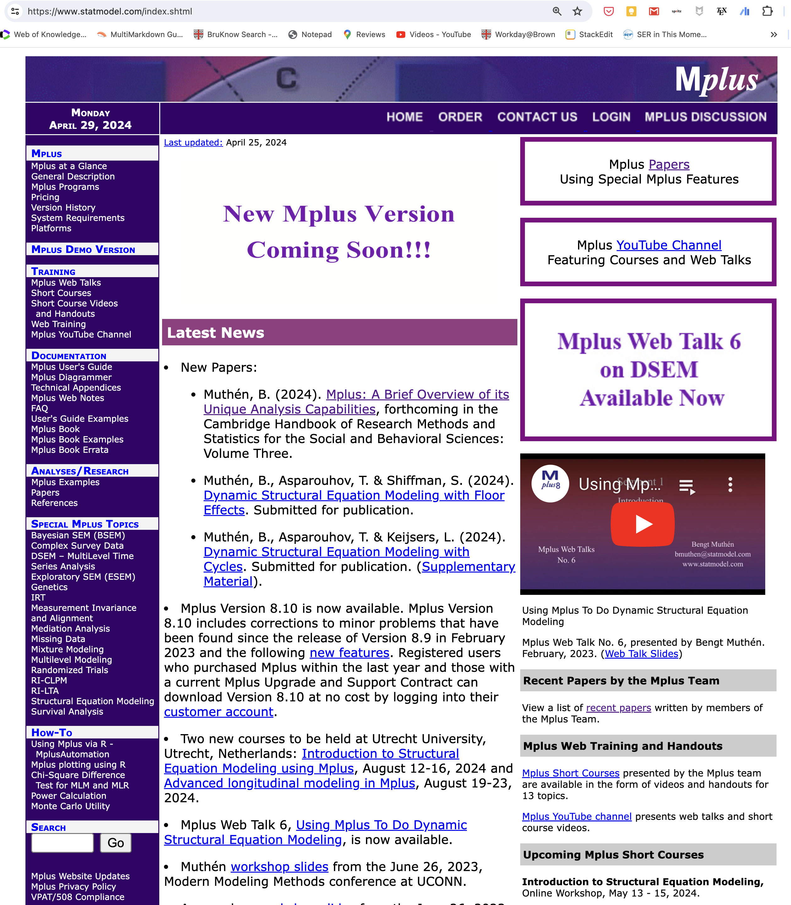
:::
::: {.column width="33%"}

:::
::: {.column width="33%"}
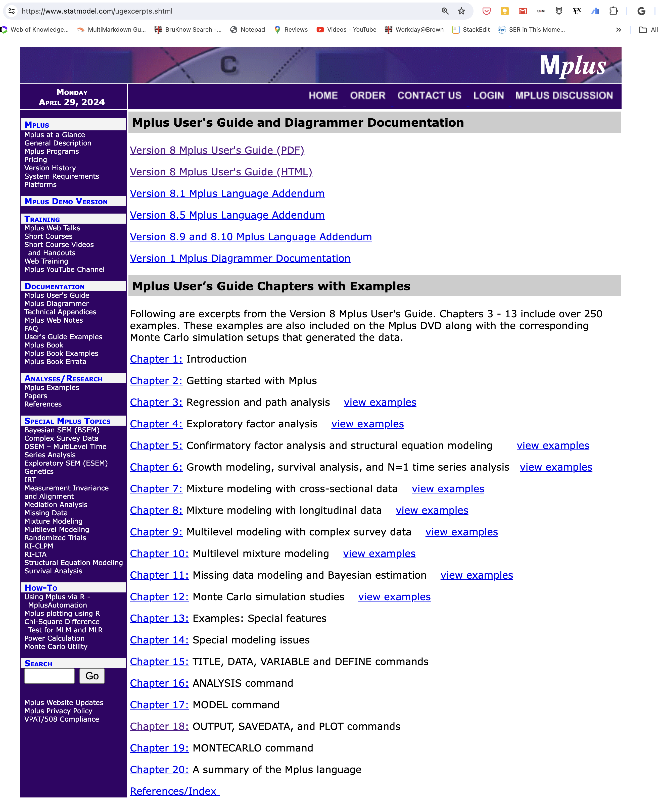
:::
:::

## Learning Mplus

::: {.small-text}
MPLUS User Guide (Muthén & Muthén, 1998-2024) is the primary resource for learning Mplus syntax. The Mplus Discussion forum is also a helpful resource for learning from examples and asking questions.
:::

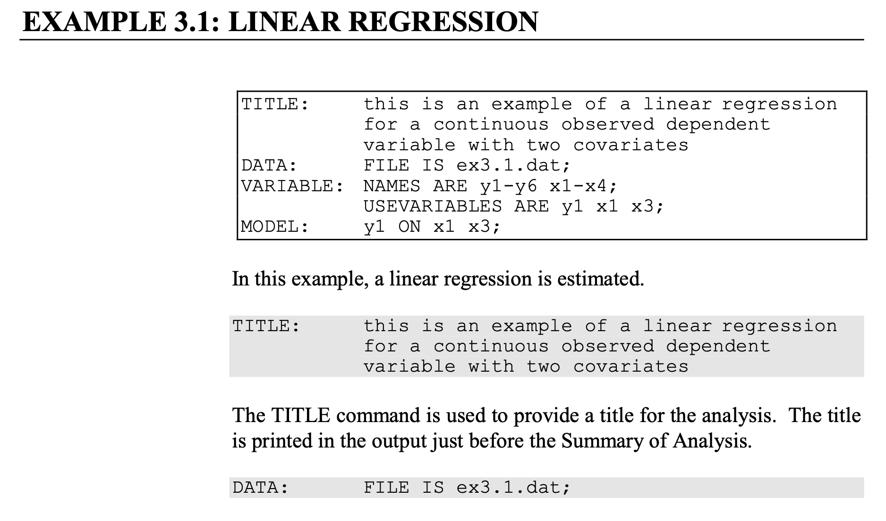{.diagram}


## Lavaan 
::: columns
::: {.column width="50%"}
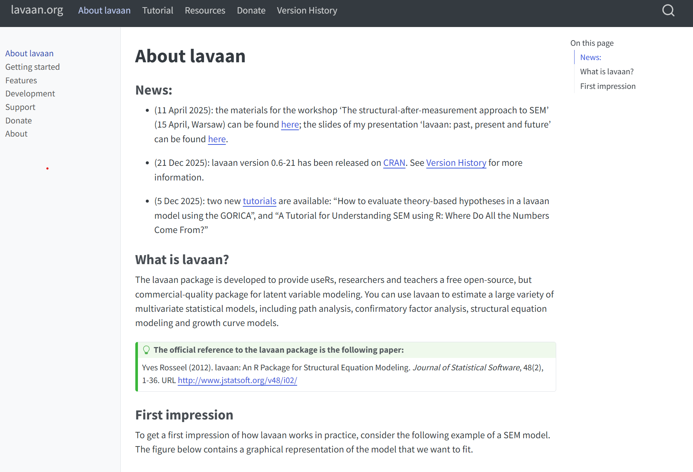
:::
::: {.column width="50%"}
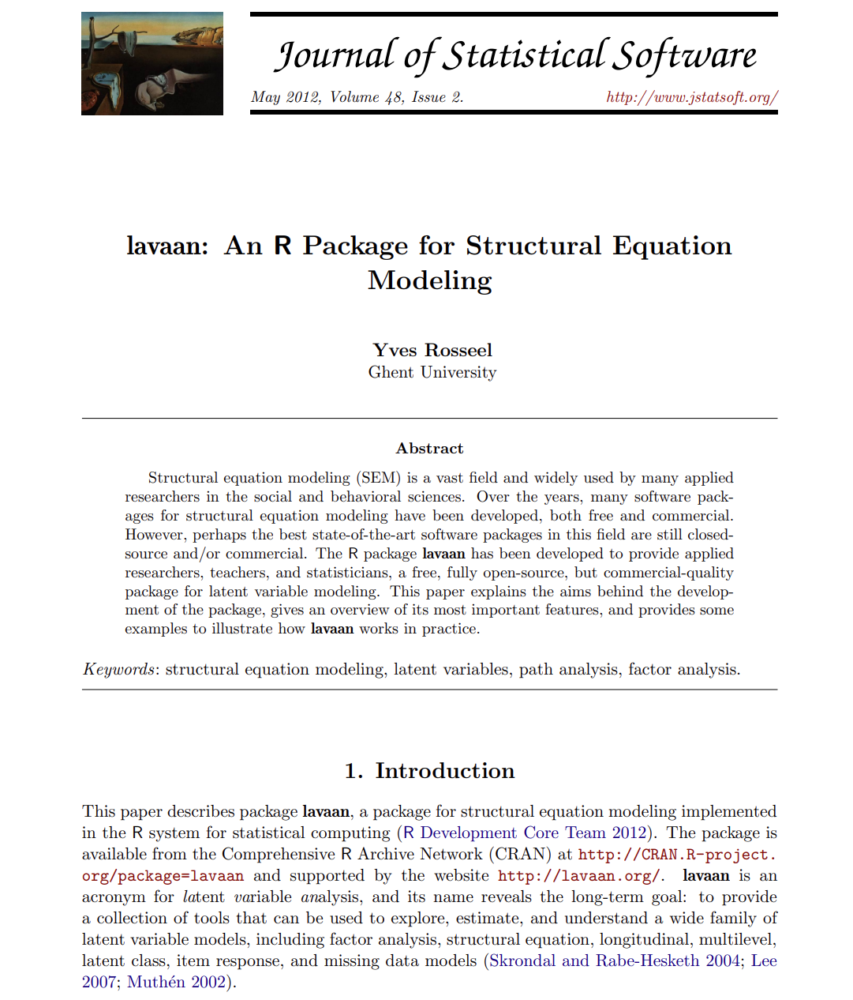
:::
:::

## Learing lavaan 
::: {.small-text}
lavaan documentation and examples are available on the lavaan website (Rosseel, 2012-2024). Reading and modifying existing models is one of the best ways to learn the syntax.
:::

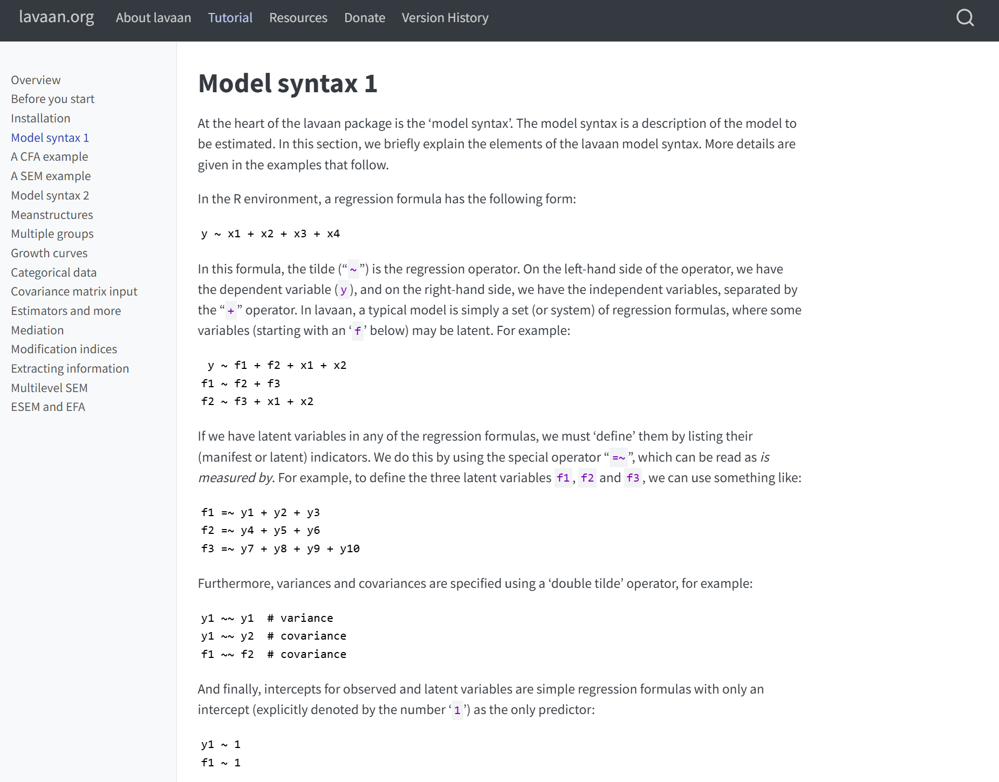{.diagram}

## Advantages and disadvantages

:::: {.columns .adv-disadv-slide}
::: {.column width="50%"}
### Mplus

**Advantages**

- Broad estimator support (MLR, WLSMV, Bayes)
- Strong for categorical, multilevel, and mixture models
- Optimized performance for complex SEM
- Better handling of binary/categorical indicators (with MLR estimator)

**Disadvantages**

- Expensive (license required)
- Less intuitive syntax for R users
- Debugging can be challenging
:::

::: {.column width="50%"}
### Lavaan

**Advantages**

- Open-source and free
- Integrates with R ecosystem (tidyverse, semTools)

**Disadvantages**

- Less efficient for very large/complex models
- Limited native support for mixture models / advanced SEM
- Survey design integration only possible for simple models (lavaan.survey package)
- No MLR estimator for categorical indicators (only WLSMV)
:::
::::

## Other options

:::: {.columns .adv-disadv-slide}
::: {.column width="50%"}
### mirt

**Best fit**

- Item response theory (IRT) models
- Binary, ordinal, and polytomous item responses (no continuous items)
- Multidimensional latent traits
- DIF and item-level measurement questions

**Why use it**

- R-native workflow for item-level measurement
- Strong option when the main object is an item bank, scale, or test
- Useful complement to SEM-focused tools
:::

::: {.column width="50%"}
### OpenMx

**Best fit**

- Flexible structural equation models
- Path, RAM, and matrix-style model specification
- Custom constraints, algebra, and likelihoods
- Complex multigroup informed models

**Why use it**

- Good when a model needs custom structure beyond standard SEM syntax
- More flexible, but often more verbose than lavaan
:::
::::

## Mplus workflow 

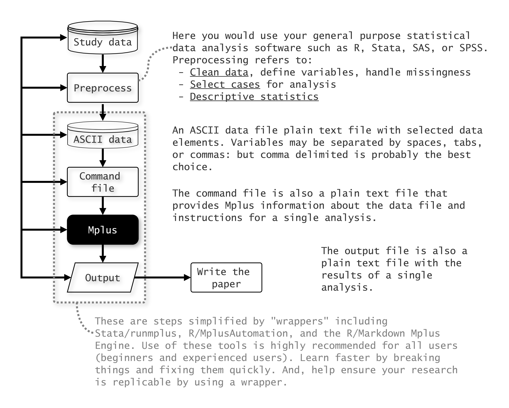{.diagram}

## Lavaan workflow

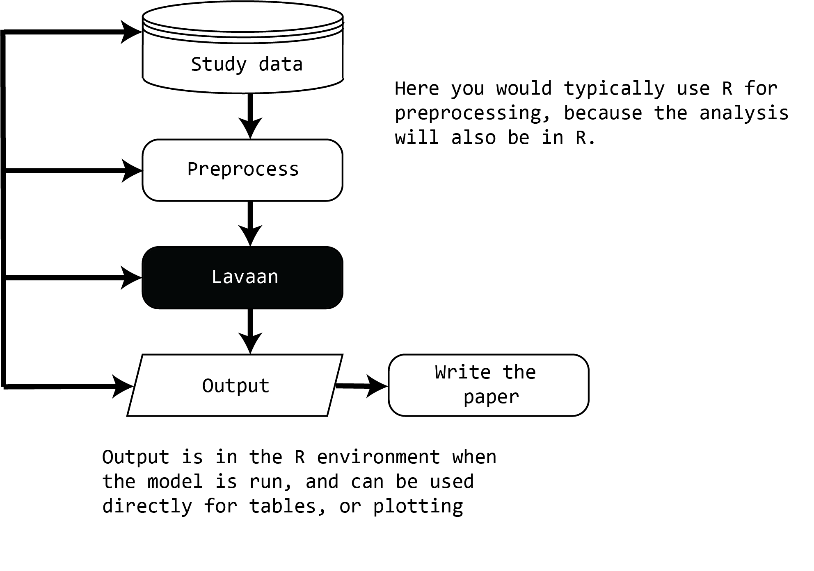{.diagram}


## Two syntaxes, one model

:::: columns
::: {.column width="50%"}
### Mplus

```mplus
TITLE:    Descriptive model name
DATA:     FILE = analysis.dat ;
VARIABLE: NAMES = y1 y2 y3 x1 x2 ;
MODEL:
          eta1 BY y1-y3 ;
          eta1 ON x1 x2 ;
OUTPUT:   STANDARDIZED ;
```
:::

::: {.column width="50%"}
### lavaan

```r
model <- '
  eta1 =~ y1 + y2 + y3
  eta1 ~ x1 + x2
'

fit <- lavaan::sem(model, data = dat)
summary(fit, standardized = TRUE)
```
:::
::::

## Software orientation

:::: columns
::: {.column width="50%"}
### Mplus input file

::: {.small-text}
- Plain text command file.
- Organized into command sections such as `DATA`, `VARIABLE`, `MODEL`, and `OUTPUT`.
- Case insensitive: `y1` and `Y1` are treated as the same variable name.
:::
:::

::: {.column width="50%"}
### lavaan model string

::: {.small-text}
- R object containing model syntax.
- Data, estimation, and output options are usually specified in R function calls.
- Case sensitive through R: `y1` and `Y1` are different variable names.
:::
:::
::::

## Model syntax operators

| Model component | Mplus | lavaan |
|---|---|---|
| Covariance | `x WITH y ;` | `x ~~ y` |
| Regression | `y ON x ;` | `y ~ x` |
| Latent factor | `eta1 BY y1-y3 ;` | `eta1 =~ y1 + y2 + y3` |
| Residual variance | `y1 ;` | `y1 ~~ y1` |
| Intercept or mean | `[y1] ;` | `y1 ~ 1` |

## Path Models

## Covariance

<div class="diagram-frame covariance-diagram">
  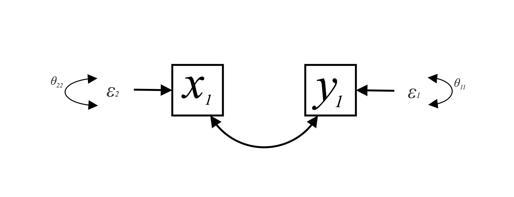
</div>

:::: {.columns .syntax-pair}
::: {.column width="50%"}
### Mplus

```mplus
TITLE:    A covariance
DATA:     FILE = temp.dat ;
VARIABLE: NAMES = y x ;
MODEL:
          x WITH y ;
```
:::

::: {.column width="50%"}
### lavaan

```r
model <- '
  x ~~ y
'

fit <- lavaan::sem(model, data = dat)
```
:::
::::

## Correlation

<div class="diagram-frame covariance-diagram">
  
</div>

:::: {.columns .syntax-pair}
::: {.column width="50%"}
### Mplus

```mplus
TITLE:    A covariance and correlation
DATA:     FILE = temp.dat ;
VARIABLE: NAMES = y x ;
MODEL:
          x WITH y ;
OUTPUT:   STANDARDIZED ;
```
:::

::: {.column width="50%"}
### lavaan

```r
model <- '
  x ~~ y
'

fit <- lavaan::sem(model, data = dat)
summary(fit, standardized = TRUE)
```
:::
::::

::: {.small-text}
The covariance is the estimated model parameter. The correlation is the standardized version of that relationship.
:::

## Simple regression

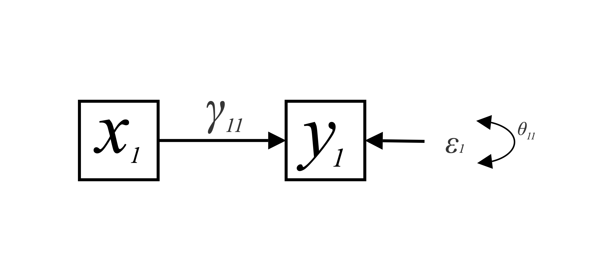{.diagram width="42%"}

:::: {.columns .syntax-pair}
::: {.column width="50%"}
### Mplus

```mplus
TITLE:    A regression
DATA:     FILE = temp.dat ;
VARIABLE: NAMES = y x ;
MODEL:
          y ON x ;
```
:::

::: {.column width="50%"}
### lavaan

```r
model <- '
  y ~ x
'

fit <- lavaan::sem(model, data = dat)
```
:::
::::

## Simple regression with intercept

<div class="intercept-diagram">
  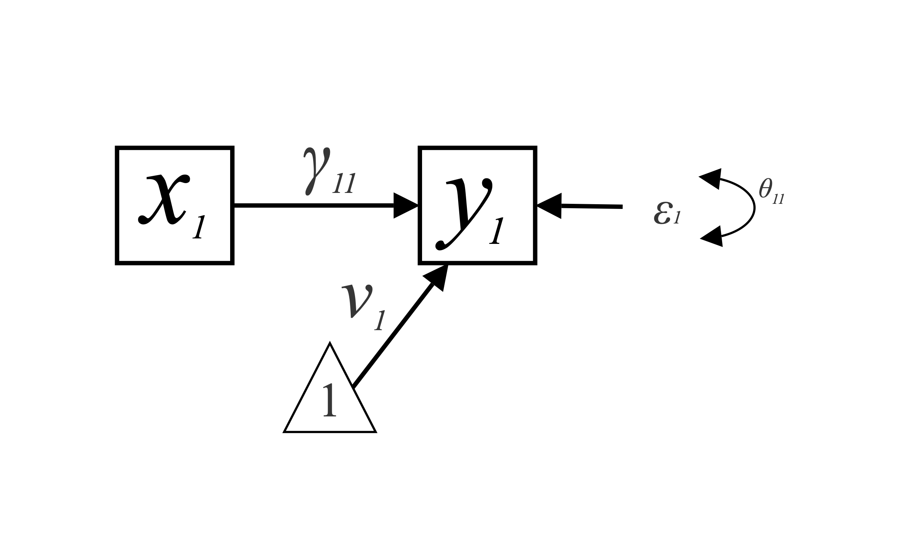
</div>

:::: {.columns .syntax-pair}
::: {.column width="50%"}
### Mplus

```mplus
TITLE:    A regression with intercept
DATA:     FILE = temp.dat ;
VARIABLE: NAMES = y x ;
MODEL:
          y ON x ;
          [y] ;
```
:::

::: {.column width="50%"}
### lavaan

```r
model <- '
  y ~ x
  y ~ 1
'

fit <- lavaan::sem(
  model,
  data = dat,
  meanstructure = TRUE
)
```
:::
::::

## Multiple regression

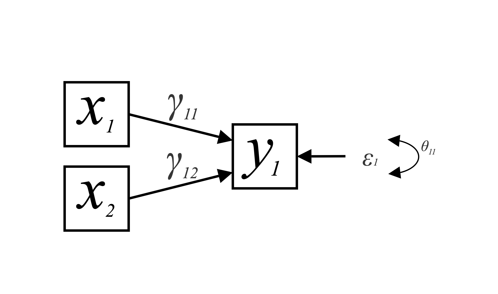{.diagram width="42%"}

$$
y_1 = \nu_1 + \gamma_{11}x_1 + \gamma_{12}x_2 + \varepsilon_1
$$

:::: {.columns .syntax-pair}
::: {.column width="50%"}
### Mplus

```mplus
MODEL:
          y1 ON x1 x2 ;
```
:::

::: {.column width="50%"}
### lavaan

```r
model <- '
  y1 ~ x1 + x2
'
```
:::
::::

## Multivariate regression

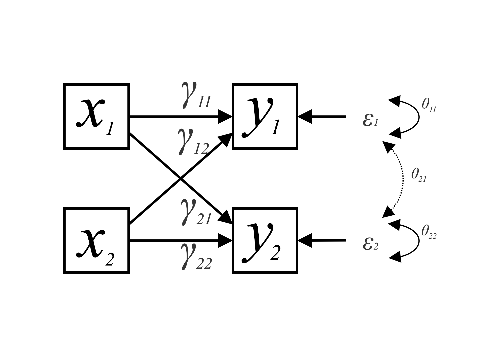{.diagram width="42%"}

$$
\mathbf{y} = \mathbf{\nu} + \mathbf{\Gamma}\mathbf{x} + \mathbf{\varepsilon}
$$

:::: {.columns .syntax-pair}
::: {.column width="50%"}
### Mplus

```mplus
MODEL:
          y1 y2 ON x1 x2 ;
```
:::

::: {.column width="50%"}
### lavaan

```r
model <- '
  y1 ~ x1 + x2
  y2 ~ x1 + x2
'
```
:::
::::

## Measurement Models

## CFA with covariates

::: {.small-text}
Also called a Multiple Indicators, Multiple Causes model. Combines a measurement model for the latent construct with observed predictors of that construct.
:::

::: {.cfa-stack}
<div class="cfa-diagram">
  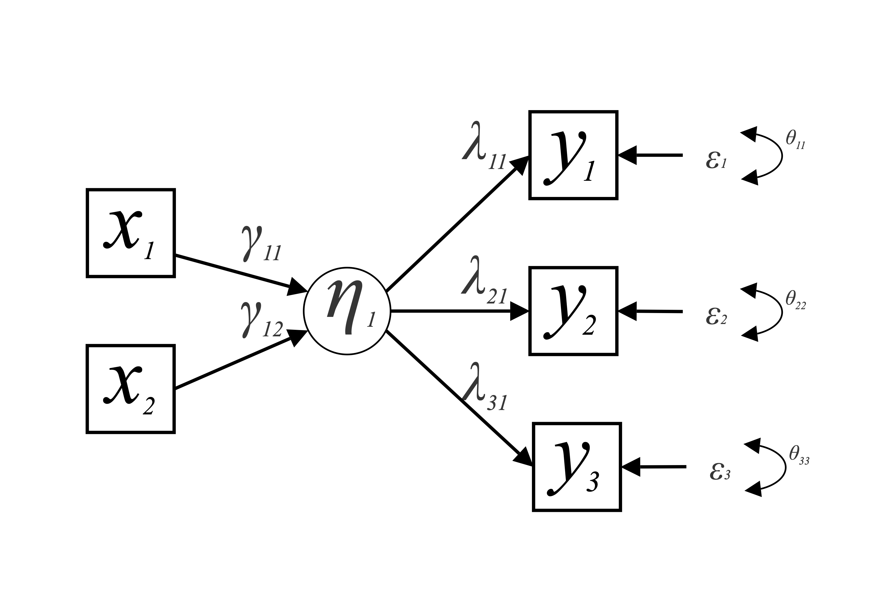
</div>

::: {.cfa-equations}
$$
\begin{aligned}
\mathbf{y} &= \mathbf{\nu} + \mathbf{\Lambda}\mathbf{\eta} + \mathbf{\varepsilon} \\
\mathbf{\eta} &= \mathbf{\alpha} + \mathbf{\Gamma}\mathbf{x} + \mathbf{\zeta}
\end{aligned}
$$
:::
:::

:::: {.columns .syntax-pair}
::: {.column width="50%"}
### Mplus

```mplus
MODEL:
          eta1 BY y1-y3 ;
          eta1 ON x1 x2 ;
```
:::

::: {.column width="50%"}
### lavaan

```r
model <- '
  eta1 =~ y1 + y2 + y3
  eta1 ~ x1 + x2
'
```
:::
::::

## MIMIC model with direct effect

::: {.mimic-stack}
<div class="mimic-diagram">
  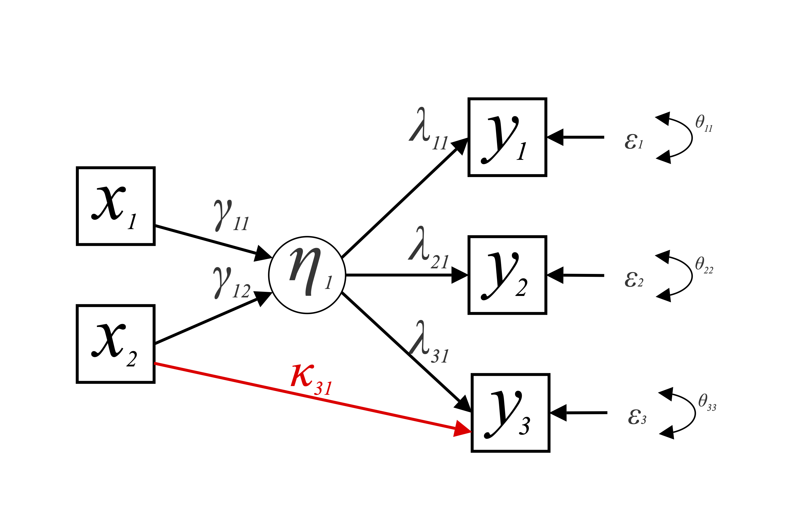
</div>

::: {.mimic-equations}
$$
\begin{aligned}
\mathbf{y} &= \mathbf{\nu} + \mathbf{\Lambda}\mathbf{\eta} + \mathbf{K}\mathbf{x} + \mathbf{\varepsilon} \\
\mathbf{\eta} &= \mathbf{\alpha} + \mathbf{\Gamma}\mathbf{x} + \mathbf{\zeta}
\end{aligned}
$$
:::
:::

:::: {.columns .syntax-pair}
::: {.column width="50%"}
### Mplus

```mplus
MODEL:
          eta1 BY y1-y3 ;
          eta1 ON x1 x2 ;
          y3 ON x2 ;
```
:::

::: {.column width="50%"}
### lavaan

```r
model <- '
  eta1 =~ y1 + y2 + y3
  eta1 ~ x1 + x2
  y3 ~ x2
'
```
:::
::::

## Model families

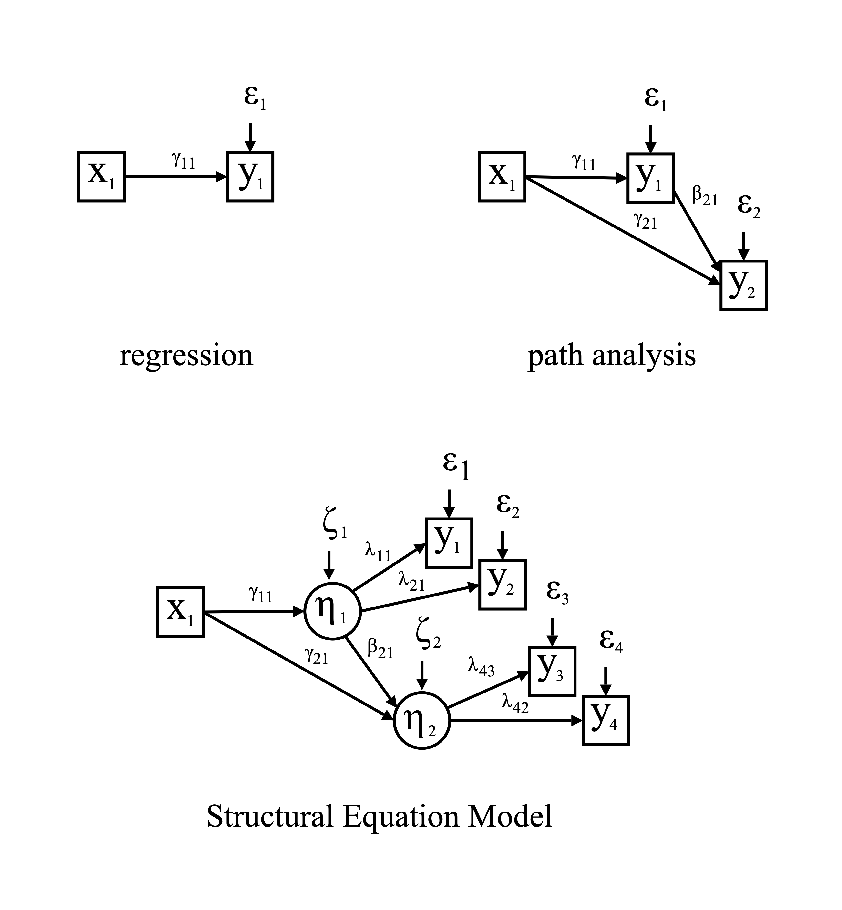{.diagram width="38%"}

::: {.model-families-table}
| Question | Model family | Typical syntax move |
|---|---|---|
| Are two observed variables related? | Covariance/correlation | `~~` or `WITH` |
| Does one observed variable predict another? | Regression | `~` or `ON` |
| Do indicators measure a latent construct? | CFA | `=~` or `BY` |
| Do covariates predict a latent construct? | MIMIC | latent variable regression |
| Does a covariate directly affect an item? | MIMIC with direct effect | item regression |
:::

## Translation habits

:::: columns
::: {.column width="50%"}
### In Mplus, look for

::: {.small-text}
- Command sections ending with semicolons.
- `BY` for measurement.
- `ON` for regressions.
- `WITH` for covariances.
- `OUTPUT: STANDARDIZED ;` for standardized results.
:::
:::

::: {.column width="50%"}
### In lavaan, look for

::: {.small-text}
- A model string passed to an R function.
- `=~` for measurement.
- `~` for regressions.
- `~~` for variances and covariances.
- `standardized = TRUE` in `summary()` for standardized results.
:::
:::
::::

## Closing takeaways

::: {.small-text}
- Mplus and lavaan express the same model ideas with different syntax conventions.
- Syntax translation is easiest when each model statement is mapped to its path diagram meaning.
:::
