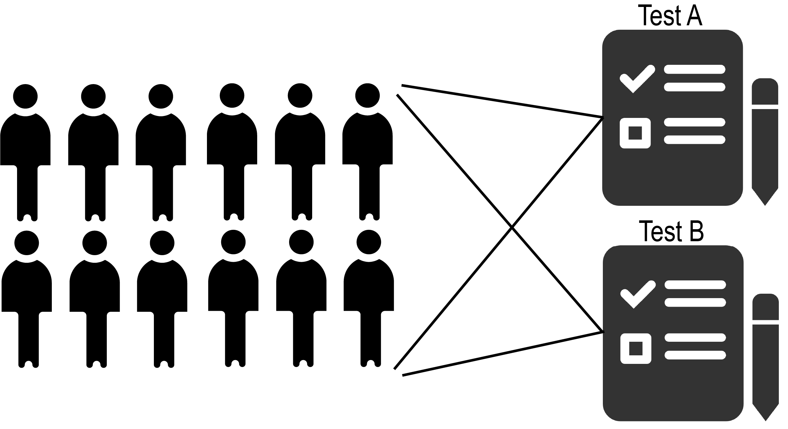
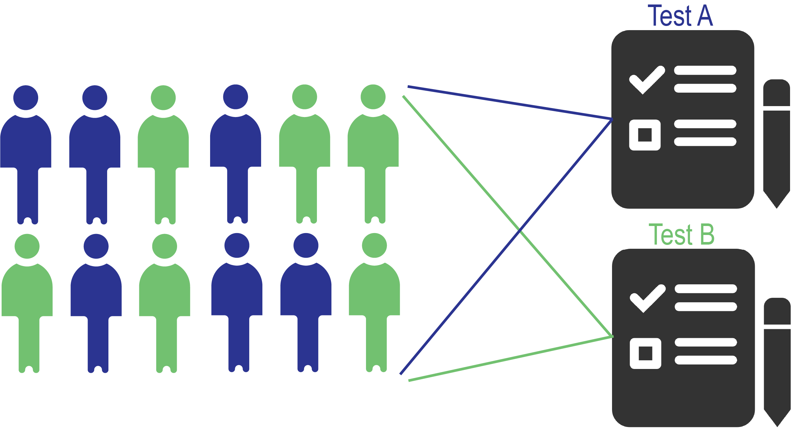
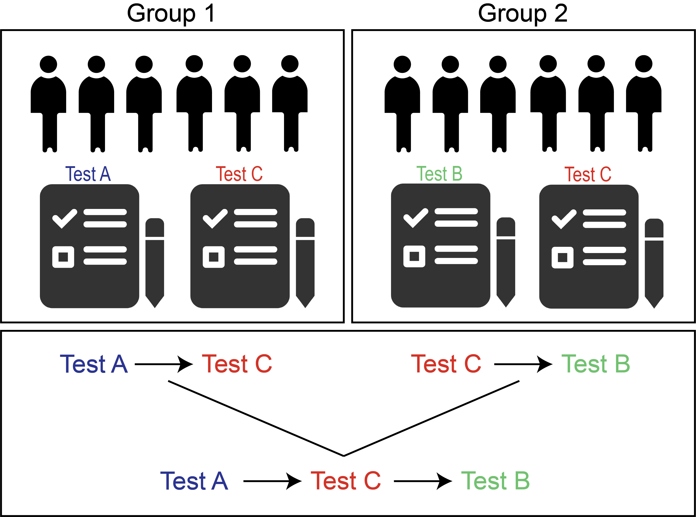
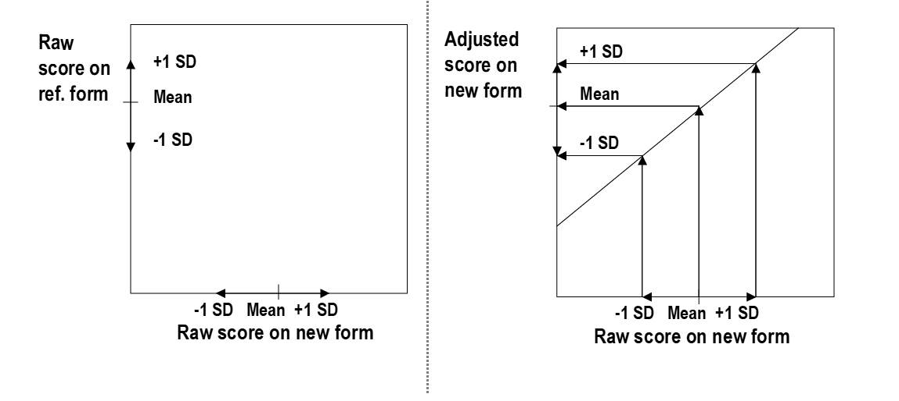
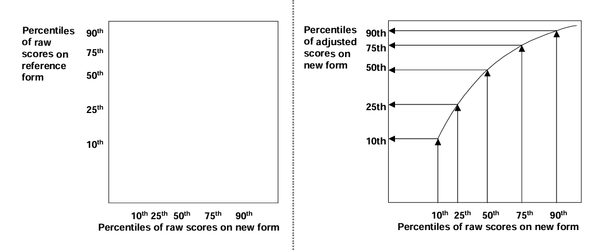
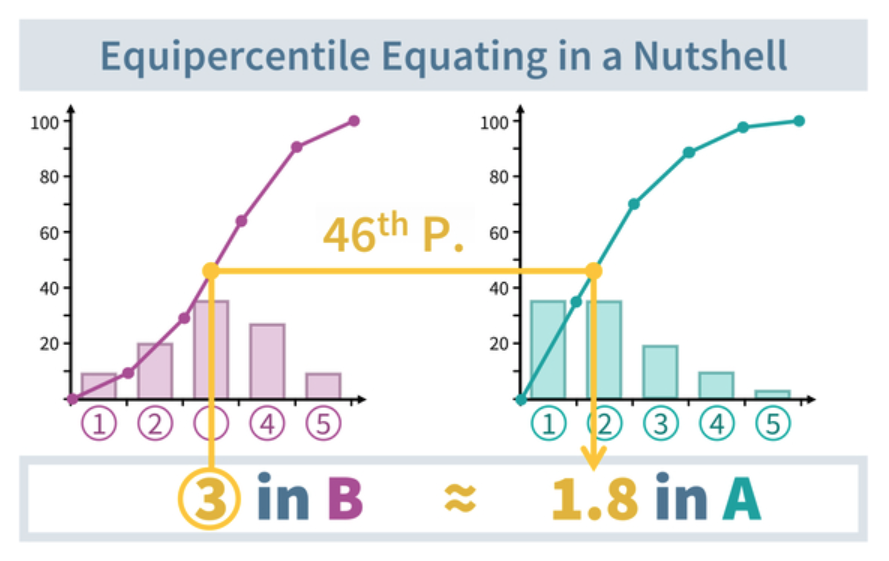
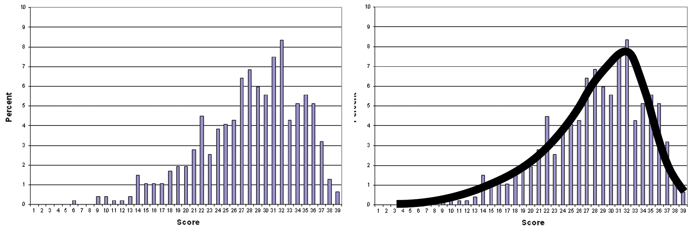
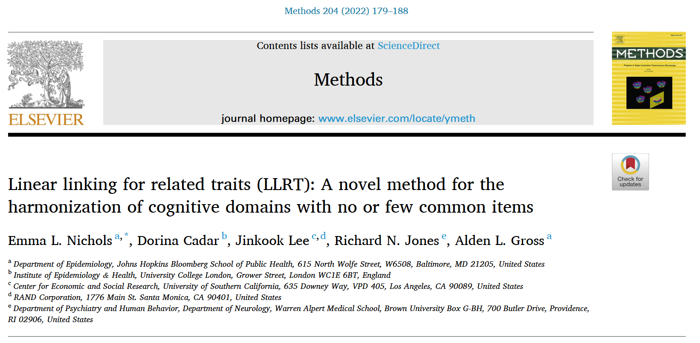
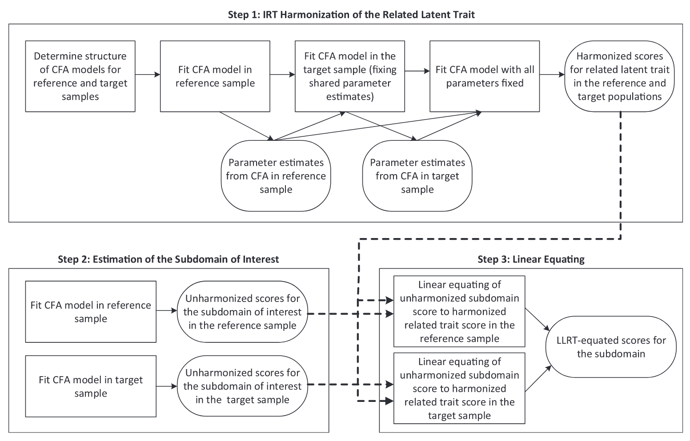
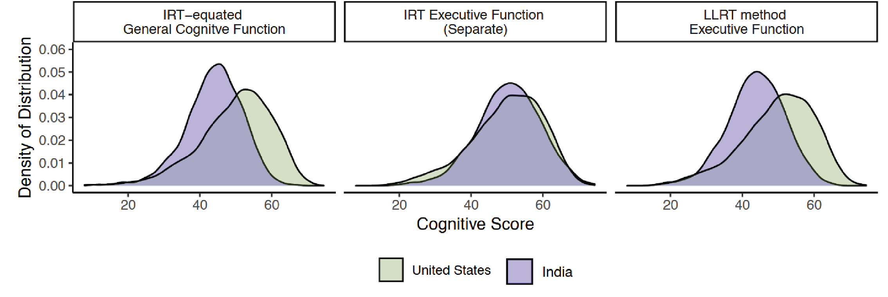

## Goals

::: {.small-text}
- Discuss linking and equating without anchor items. 
- Consider different designs and methods that are commonly used throughout the literature. 
- Introduce Linear Linking for Related Traits (LLRT), which combines anchor-item equating with linear equating and a NEAT design. 
:::

## What information can you leverage to link and equate with no (internal) anchors? 

::: {.callout-note}
We have been using the term "anchor items" to refer to shared items within a domain or construct we seek to measure. However, in linking/equating there are also references to "anchor tests," which can be thought of as external anchors that are shared across groups but not necessarily within the same domain or construct (though they should be strongly related for the methods to work well).
:::

::: {.small-text}
- Information on test performance in the same people (common person design)
- Differences in test performance across groups assuming there are no differences in ability due to randomization (random groups design) 
- Differences in test performance across groups that are different, but where we have adjusted for these differences (via weighting or matching) 
- Information on a similar test, common across groups (Nonequivalent groups with anchor test [NEAT] design) 
:::

## Common person design 

{.diagram}

## Random groups design 

{.diagram}

- If groups are non-random, can use matching or weighting to adjust for differences in ability across groups.

## NEAT design 

{.diagram}

Within each group, we have a common person design. 

## Methods for linking and equating within each design 

- Linear equating 
- Equipercentile equating

## Linear equating 

{.diagram}

For a common person or random groups design: 

$$
\frac{Y-mean(Y)}{SD(Y)} = \frac{X-mean(X)}{SD(X)}
$$

:::{.slide-citation}
[@livingston_equating_2014]
:::

## Linear equating challenges 

- Very high or low scores prior to the transformation can lead to scores outside the range of the scale after transformation.
- Assumes a linear relationship between the two tests, which may not always hold.
- Can heavily depend on the ability of the common group used to create the transformation. 

:::{.slide-citation}
[@livingston_equating_2014]
:::

## Equipercentile equating 

{.diagram}

:::{.slide-citation}
[@livingston_equating_2014]
:::

## Equipercentile equating - another example 

{.diagram}

:::{.slide-citation}
[@singh_cats_2021]
:::

## Equipercentile equating challenges

:::{.small-text}
- Distributions of test scores often have irregularities
- Equating relationship cannot be determined for parts of the score range that are not observed in the data (e.g., very high or low scores)
:::

:::{.my-center}
Solution = smoothing
:::

{.diagram}

:::{.slide-citation}
[@livingston_equating_2014]
:::

## Linear Linking for Related Traits (LLRT)

:::{.small-text}
Developed for use in the context of specific cognitive domains without internal anchor items, where internal anchor items exist for a larger related or subsuming trait, such as general cognitive functioning  
:::

{.diagram}

## LLRT approach 

{.diagram}

:::{.slide-citation}
[@nichols_linear_2022]
:::

## LLRT example 

{.diagram}

:::{.slide-citation}
[@nichols_linear_2022]
:::

## Intuition for LLRT 

:::{.small-text}
What we are essentially doing is: 

1. Estimate within-group ordering based on within-group CFA models in the domain of interest (e.g., executive functioning).
2. Estimate group differences (in mean and scaling) based on the harmonized related trait of interest (e.g., general cognitive functioning).
3. Impose group differences from related trait, but retain within-group ordering from domain of interest to get the final result. 

Note: using linear equating (rather than equipercentile equating) is probably okay because when generating factor scores from CFA models, we are already assuming that the latent traits are normally distributed.  
:::

## Closing takeaways 

::: {.small-text}
- All is not lost if you don't have internal anchor items. 
- Different, arguably stronger assumptions are needed, but there are options. 
- The design needs to leverage common information in some form: either from the same people, from comparable groups (randomization or modeling), from an external anchor test, or from a related trait with internal anchors.
- Linear equating and equipercentile equating are perhaps the most commonly used methods that you will see in the literature, but LLRT is another option designed explicitly for cross-national harmonization of cognitive sub-domains. 
:::

## References

::: {#refs}
:::